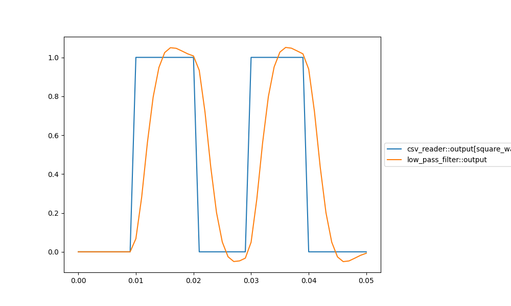

# Tutorial 3: Time Signals

In this tutorial you will learn:
- How to use the TimeSignal type to represent time series
- How to use the MultiSignal type to handle blocks that produce a variable number of output signals
- How to plot signals and save data using the `commands` section of the project file

### Representing Time Signals

Sampled time signals are very common in scientific computing. Pyblock-sim supports this data type
through the TimeSignal type. This class has two properties `time` and `wave`, both of which are instances of
the `nd.nparray` type.

### Reading from csv files

The block `com.pyblocks.basic.csv_reader` allows us to read a signal from a csv
file. Each column is expected to contain a series of values with the first row
being a header naming the series. For example:

| time | voltage |
|------|--------|
| 0.0  | 0      |
| 0.1  | 3.3    |
| 0.2  | 3.3    |
| 0.3  | 0      |
| ...  | ...    |
| 10.0 | 0      |

A suitable csv file containing a square wave is available at `src/tutorials/3_time_signals/square_wave.csv`

Let's look at the section of the project file available at `src/tutorials/3_time_signals/project.json` relevant
to the csv reader block.

```json
{
  "blocks": [
    {
      "distribution_id": "com.pyblocks.basic.csv_reader",
      "instance_id": "csv_reader",
      "parameters": [
        {
          "param_id": "file", "value": "./square_wave.csv"
        },
        {
          "param_id": "combine_signals",
          "value": [
            {
              "name": "square_wave",
              "time_column": "time",
              "value_column": "voltage"
            }
          ]
        }
      ]
    }
  ]
}
```

The first parameter indicates the file to be read. Note that the path is relative to the location of
the project file. The second parameter, `combine_signals` is optional: if it is **not** provided, each 
column will be made available as its own signal, but we want the two columns to be combined into a 
single TimeSignal. Each item inside the `value` array creates a time signal. `name` specifies the 
name of the resulting signal and `time_column` and `value_column` specify which columns will be used
by passing to the block the name of the headers in the file.

### MultiSignals

When reading from a csv, we have a variable number of signals in a single file.
On [Tutorial 2](../2_calculator/tutorial_2_calculator.md) we saw that a block implementation declares a fixed number
of outputs. This can be overcome by using the MultiSignal type.

A MultiSignal is an object placed on an output port jus like any other signal. This object acts
as a dictionary where the keys are signal names (strings) and the values are the actual signals. 
The following snippet demonstrates this structure:

```
OutputPort {
    port_id: "output"
    signal: MultiSignal {
        key: "square_wave",
        value: TimeSignal
    }
}
```

Accessing the time and value of the TimeSignal would look like this:

```python
time = self.output_port.signal['square_wave'].time
value = self.output_port.signal['square_wave'].wave
```

Pyblock-sim knows about the MultiSignal type and provides us a useful shorthand to connecting
blocks that use this type. We will connect `csv_reader` to a low pass filter:

```json
{
  "blocks": [...],
  "connections": [
    {
      "from": "csv_reader::output[square_wave]",
      "to": "low_pass_filter::input"
    }
  ]
}
```

Here we see the full syntax of a port selector, which takes the form `block_instance_id::port_id[signal_name]`

### Plotting signals

With the information provided so far we can write the whole `project.json` file. We add the `commands` section
and include the `plot` command.

```json
{
  "blocks": [
    {
      "distribution_id": "com.pyblocks.basic.csv_reader",
      "instance_id": "csv_reader",
      "parameters": [
        {
          "param_id": "file", "value": "./square_wave.csv"
        },
        {
          "param_id": "combine_signals",
          "value": [
            {
              "name": "square_wave",
              "time_column": "time",
              "value_column": "voltage"
            }
          ]
        }
      ]
    },
    {
      "distribution_id": "com.pyblocks.signal.low_pass",
      "instance_id": "low_pass_filter",
      "parameters": [
        {
          "param_id": "f_cutoff", "value": "100"
        }
      ]
    }
  ],
  "connections": [
    {
      "from": "csv_reader::output[square_wave]",
      "to": "low_pass_filter::input"
    }
  ],
  "commands": [
    {
      "command": "simulate"
    },
    {
      "command": "plot",
      "parameters": [
        {
          "param_id": "signals",
          "value": [
            "csv_reader::output[square_wave]",
            "low_pass_filter::output"
          ]
        },
        {
          "param_id": "save_path",
          "value": "./outputs/tutorial_3_time_signals_plot.png"
        }
      ]
    }
  ]
}
```

In the `parameters` section of the plot command we provide a list of signals using the 
signal selector syntax. The `save_path` parameter is optional. If it is provided, the 
following plot will be saved as an image in the specified file.



TimeSignal data can be extracted using the `save` command. If we put the following object 
in the `commands` array the signals will be saved in a .csv file with similar structure 
to the one we used as input in this example.

```json
{
  "command": "save",
  "parameters": [
    {
      "param_id": "save_path",
      "value": "./outputs/signals.csv"
    },
    {
      "param_id": "signals",
      "value": [
          "csv_reader::output[tx_in]",
          "csv_reader::output[rx_out]",
          "ltspice_rx::signal_out[V(Saida)]"   
      ]
    }
  ]
}
```
