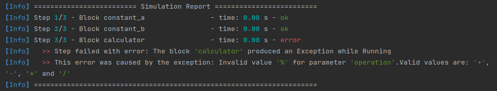

# Tutorial 2: Calculator

In this tutorial you will learn:
- How to implement a block
- Reading inputs and writing outputs
- Getting parameters from the user

In this example we will implement a block that performs arithmetic operations on two inputs `a` and `b` and 
produces an output `result`. The operation to be performed is configured through the parameter `operation`.

### Project File

We will begin with the project file shown below. The fields of a project file are explained in
[Tutorial 1](tutorial_1_string_transform.md). This project file is available at `src/tutorials/2_calculator/project.json`.

```json
{
  "blocks": [
    {
      "distribution_id": "com.pyblocks.basic.constant",
      "instance_id": "constant_a",
      "parameters": [
        {
          "param_id": "constant",
          "value": 2
        }
      ]
    },
    {
      "distribution_id": "com.pyblocks.basic.constant",
      "instance_id": "constant_b",
      "parameters": [
        {
          "param_id": "constant",
          "value": 3
        }
      ]
    },
    {
      "distribution_id": "com.pyblocks.tutorials.calculator",
      "instance_id": "calculator",
      "parameters": [
        {
          "param_id": "operation",
          "value": "+"
        }
      ]
    }
  ],
  "connections": [
    {
      "from": "constant_a::output",
      "to": "calculator::a"
    },
    {
      "from": "constant_b::output",
      "to": "calculator::b"
    }
  ]
}
```

This project file describes the following simulation scenario. Parameters are omitted from this image.

We will now implement the calculator block but running this file should already work because the
tutorial blocks are distributed as part of the builtin block library. The completed calculator
implementation is available under `src/block_library/tutorials/calculator`.

### Creating the Block

A block must:
 - Contain a file called `block.py` in a folder inside a directory that is part of the block library
 - Contain a class that inherits from `BaseBlock` inside `block.py`
 - Define its metadata, ports and parameters in the `__init__(self)` method
 - Implement the `run(self)` method that will be called during the simulation

We begin by creating the class and its initializer:

```python
# block.py
from src.pyblock.block.base_block import BaseBlock
from src.pyblock.block.block_info import BlockInfo
from src.pyblock.block.params.parameter import Parameter
from src.pyblock.block.ports.input_port import InputPort
from src.pyblock.block.ports.output_port import OutputPort

class CalculatorBlock(BaseBlock):
    def __init__(self):
        # define metadata
        self.info = BlockInfo(
            distribution_id='com.pyblocks.tutorials.calculator',
            name='Arithmetic Calculator',
            description="This simple arithmetic calculator shows how to implement a custom block"
        )

        #define inputs and outputs
        self.input_a = InputPort(port_id='a')
        self.input_b = InputPort(port_id='b')
        self.output = OutputPort(port_id='output')
        
        #define parameters
        self.operation = Parameter(param_id='operation', default='+')

    def run(self):
        # TODO
        pass
```

The simulator reads the properties created in the initializer to learn about the metadata, inputs, outputs 
and parameters. All that is needed is to create the appropriate properties with the correct object types. 
The `self.info` property is required and must have this name. The other properties can have whatever names 
you like. The `distribution_id`, port IDs and parameter IDs used in the project file must match those defined
in the block implementation.

### Accessing Parameter and Port Values

The Parameter object has the property `value`, which can be accessed to read the value passed by the user in 
their project file. This property is set by the simulator after the initializer and before the call to `run`.

```python
param_value = self.my_parameter.value
```

Note that in this block we specified a default value when constructing the Parameter object. This means that if
no user value is provided in the project file, the default value will be returned when reading the `value` property.

For input and output ports the `signal` property can be accessed to read inputs and written to set outputs.

```python
# read input port
input_value = self.input_port.signal

# write to output port
self.output_port.signal = output_value
```

Knowing that, we may write the `run` method of our calculator block:

```python
    def run(self):
        in_a = self.input_a.signal
        in_b = self.input_b.signal
        operation = self.operation.value

        if operation == '+':
            result = in_a + in_b
        elif operation == '-':
            result = in_a - in_b
        elif operation == '*':
            result = in_a * in_b
        elif operation == '/':
            result = in_a / in_b
        else:
            raise ValueError(
                f"Invalid value '{operation}' for parameter 'operation'."
                f"Valid values are: '+', '-', '*' and '/'"
            )

        self.output.signal = result
```

Note that if the parameter specifies an invalid operation, an error is raised. Raising an error
in the `run` method will stop the simulation and produce a message in the simulation report:



